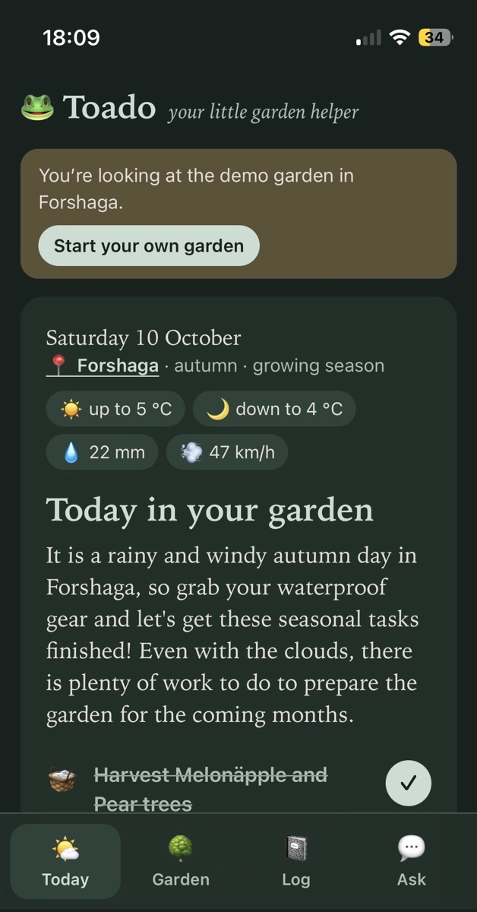
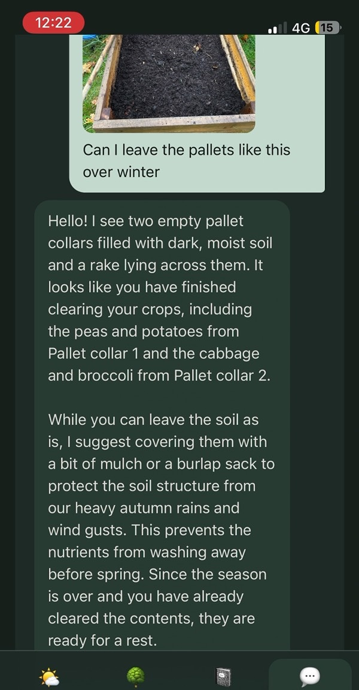
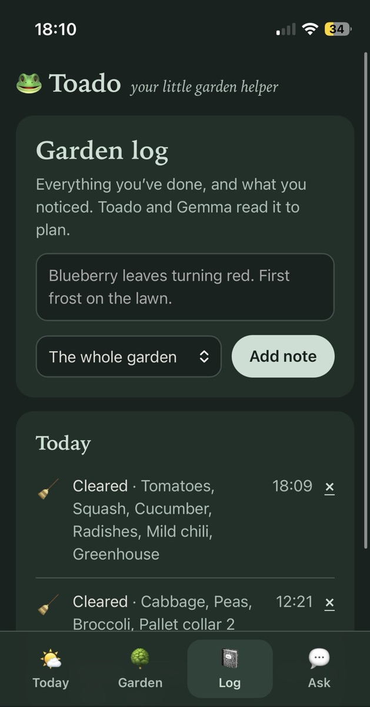

# Toado 🐸

*Your little garden helper.*

Toado is a year-round garden to-do app with a toad on it. It looks at your own garden (trees, bushes, beds, greenhouse), the season and today's weather, then gives you a few short jobs to do outside. Gemma runs locally through Ollama, so your garden data stays on your machine.

## Demo

A rainy October Saturday: Toado's plan for the day, then asking Gemma about the cleared pallet collars with a photo.

VIDEO_LINK

<p>
  
  
  
</p>

## Setup

1. Install [Ollama](https://ollama.com) and pull a Gemma model:

   ```bash
   ollama pull gemma4:26b
   ```

2. Install dependencies and start the app:

   ```bash
   pnpm install
   pnpm dev
   ```

To use a different model, change `VITE_OLLAMA_MODEL` in `.env`.

## Scripts

- `pnpm dev`: start the dev server (proxies `/ollama` to `localhost:11434`)
- `pnpm test`: run the unit tests
- `pnpm build`: type-check and build

## License

[MIT](LICENSE)
